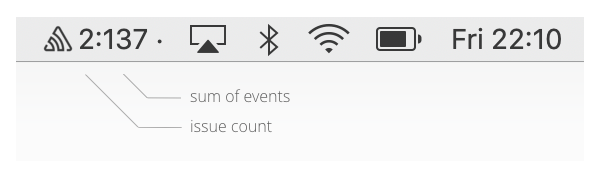

# SentryToolbar

[](https://codeclimate.com/github/evandroflores/SentryToolbar/maintainability)
[](https://codebeat.co/projects/github-com-evandroflores-sentrytoolbar-master)




This is a ongoing pet project that aims to create a MacOS toolbar to follow errors on Sentry.

Still in a very experimental phase. [PRs](https://github.com/evandroflores/SentryToolbar/pulls) and [issues](https://github.com/evandroflores/SentryToolbar/issues) are very welcome.

Edit the config file to add your Sentry token, Organization slug, Project slug...
    `~/Library/Containers/br.com.eof.SentryToolbar/Data/.SentryToolbar.plist`

```
<?xml version="1.0" encoding="UTF-8"?>
<!DOCTYPE plist PUBLIC "-//Apple//DTD PLIST 1.0//EN" "http://www.apple.com/DTDs/PropertyList-1.0.dtd">
<plist version="1.0">
<dict>
    <key>filters</key>
    <dict>
        <key>FilterA</key>
        <dict>
            <key>isActive</key>
            <true/>
            <key>issues</key>
            <array/>
            <key>name</key>
            <string>FilterA</string>
            <key>organizationSlug</key>
            <string>myorganization</string>
            <key>projectSlug</key>
            <string>myproject</string>
            <key>query</key>
            <string>is:unresolved</string>
            <key>environment</key>
            <string>production</string>
        </dict>
        <key>FilterB</key>
        <dict>
            <key>isActive</key>
            <true/>
            <key>issues</key>
            <array/>
            <key>name</key>
            <string>FilterB</string>
            <key>organizationSlug</key>
            <string>myorganization</string>
            <key>projectSlug</key>
            <string>myotherproject</string>
            <key>query</key>
            <string>is:unresolved</string>
            <key>environment</key>
            <string></string>
        </dict>
    </dict>
    <key>token</key>
    <string>YOUR TOKEN</string>
    <key>betaMode</key>
    <false/>
</dict>
</plist>
```
