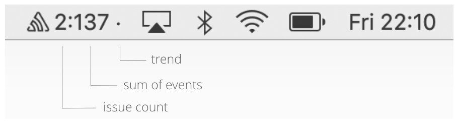

# SentryToolbar

[](https://codeclimate.com/github/evandroflores/SentryToolbar/maintainability)
[](https://codebeat.co/projects/github-com-evandroflores-sentrytoolbar-master)




This is a ongoing pet project that aims to create a MacOS toolbar to follow errors on Sentry.

Still in a very experimental phase. [PRs](https://github.com/evandroflores/SentryToolbar/pulls) and [issues](https://github.com/evandroflores/SentryToolbar/issues) are very welcome.

If you want to give a try, you can download the app [here](https://www.dropbox.com/s/3pmlkmo2d4kya4d/SentryToolbar.app.zip?dl=0)

Edit the config file to add your Sentry token, Organization slug, Project slug...
    `~/Library/Containers/br.com.eof.SentryToolbar/Data/.SentryToolbar.plist`

```
<?xml version="1.0" encoding="UTF-8"?>
<!DOCTYPE plist PUBLIC "-//Apple//DTD PLIST 1.0//EN" "http://www.apple.com/DTDs/PropertyList-1.0.dtd">
<plist version="1.0">
   <dict>
      <key>filters</key>
      <dict>
         <key>FilterA</key>
         <dict>
            <key>environment</key>
            <string />
            <key>isActive</key>
            <true />
            <key>name</key>
            <string>FilterA</string>
            <key>organizationSlug</key>
            <string>myorg</string>
            <key>projectSlug</key>
            <string>frontend</string>
            <key>query</key>
            <string>is:unresolved</string>
            <key>statsPeriod</key>
            <string>14d</string>
         </dict>
         <key>FilterB</key>
         <dict>
            <key>environment</key>
            <string />
            <key>isActive</key>
            <true />
            <key>name</key>
            <string>FilterB</string>
            <key>organizationSlug</key>
            <string>myorg</string>
            <key>projectSlug</key>
            <string>backend</string>
            <key>query</key>
            <string>is:unresolved+package.name</string>
            <key>statsPeriod</key>
            <string>14d</string>
         </dict>
      </dict>
      <key>notifyNewCount</key>
      <true />
      <key>notifyNewIssue</key>
      <true />
      <key>showCountTrend</key>
      <true />
      <key>showEventCount</key>
      <true />
      <key>showIssueCount</key>
      <true />
      <key>token</key>
      <string>YOUR TOKEN</string>
   </dict>
</plist>
```
